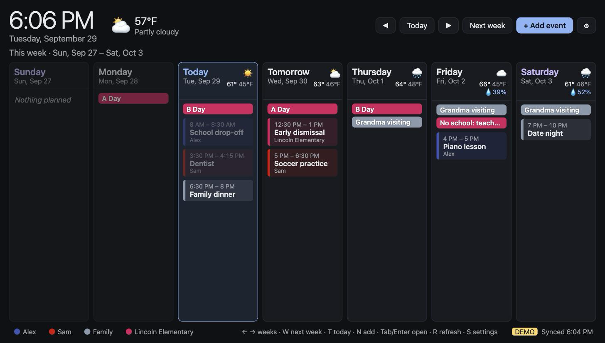

# HomePlanner

**A family wall calendar for the Raspberry Pi.** It shows the whole family's week at a glance on any screen, synced with a shared Google Calendar. Anyone at home can add or change events from the wall, or from their phone.



*Screenshot from demo mode: the names and events are made up.*

## Features

- **Week at a glance:** Sunday to Saturday, with today highlighted and past days dimmed. Browse week by week.
- **Google Calendar sync:** shows a shared family Google calendar and refreshes every 2 minutes. Changes made on phones appear automatically.
- **Add, edit and delete events** from the wall (keyboard and mouse, or a touchscreen), including repeating events ("This event" or "All events").
- **Color per person**, using Google's own event colors, so the wall matches everyone's phones. Click a name in the legend to highlight just their events.
- **Other calendars:** add read-only iCal feeds such as school or sports calendars, each with its own name and color.
- **Weather:** current conditions and a daily forecast from [Open-Meteo](https://open-meteo.com/), with no API key needed.
- **Screen sleep:** turns the screen off at night on a schedule; any key or mouse movement wakes it.
- **Phones and laptops at home:** optional access over your home network, protected by a PIN.
- **Resilient:** keeps showing the last synced events when offline, and recovers by itself after reboots and network drops.

## How it works

```
 Google Calendar ◄── service account ──┐
 Open-Meteo (weather) ◄────────────────┤
 iCal feeds (school, sports) ◄─────────┤
                                       │
                 ┌─────────────────────┴───────────────────┐
                 │ HomePlanner service (Python / FastAPI)  │
                 │  syncs calendars and weather, serves the │
                 │  web page and JSON API on port 8000      │
                 └──────┬───────────────────────┬──────────┘
                        │ localhost             │ home network (PIN)
        ┌───────────────┴─────────┐   ┌─────────┴───────────┐
        │ Chromium, full-screen    │   │ phones and laptops   │
        │ on the wall display      │   │ (optional)           │
        └──────────────────────────┘   └──────────────────────┘
```

- **Google access:** a Google **service account** (a robot account) that you share your family calendar with. There's no personal Google login on the Pi, and nothing expires.
- **The display:** the Pi boots straight into Chromium in kiosk mode, showing the page served by the local service.
- **Everything runs on the Pi.** There's no cloud service of its own and no tracking.

## What you need

- A Raspberry Pi 5 (a Pi 4 should also work), with its official power supply and a microSD card
- A screen with HDMI
- A wireless keyboard and mouse, or a USB touchscreen
- A Google account with a shared "family" calendar (the setup guide shows how to create one)

## Getting started

### Try the demo

You can try HomePlanner on any computer with Python 3.11 or newer, in demo mode. It uses made-up events and weather, and needs no Google account or Pi:

```bash
git clone https://github.com/wentzeld/homeplanner.git homeplanner
cd homeplanner
python3 -m venv .venv
.venv/bin/pip install -e ".[dev]"
HOMEPLANNER_DEMO=1 HOMEPLANNER_CONFIG=config.example.toml .venv/bin/uvicorn homeplanner.main:app --port 8000
```

Then open <http://localhost:8000>. Events you add in demo mode are kept only until you stop it.

### Set it up on a Raspberry Pi

1. **[Google setup](docs/google-setup.md)** (about 10 minutes): create the service account and share your family calendar with it.
2. **[Raspberry Pi setup](deploy/README.md)** (about 45 minutes): prepare the SD card, fill in `config.toml`, and run the installer.

The Pi setup guide also covers daily use, adding school or sports calendars, using it from your phone, updating, and troubleshooting.

## Configuration

Copy `config.example.toml` to `config.toml` and edit it. Every option is explained in the example file:

| Setting | What it is |
|---|---|
| `calendar_id` | The shared family calendar's ID (Google Calendar → Settings and sharing → Integrate calendar) |
| `timezone` | e.g. `America/Los_Angeles` |
| `service_account_file` | Optional. Where the Google key is; the default is `~/.config/homeplanner/service-account.json` |
| `[[members]]` | One per person: `name`, a Google event `color_id` (`"1"`–`"11"`), and an optional wall-only `display_color` |
| `[weather]` | `latitude`, `longitude`, `temperature_unit` (`"celsius"` or `"fahrenheit"`) |
| `[sleep]` | `off` / `on` times, `wake_minutes` after a key press, and the display `output` name |
| `cache_dir`, `data_dir` | Where saved events (`cache/`) and your calendars list and PIN (`data/`) are kept |

The app also reads these environment variables. The Pi's service file sets them for you:

| Variable | Effect |
|---|---|
| `HOMEPLANNER_CONFIG` | Path to `config.toml` (default: `./config.toml`) |
| `HOMEPLANNER_DEMO=1` | Use made-up events and weather instead of Google |
| `HOMEPLANNER_REMOTE=1` | Allow other devices on the home network in, behind a PIN |
| `HOMEPLANNER_SCREEN_CONTROL=1` | Actually switch the screen off and on (otherwise it's only logged) |

## Security and privacy

- **Your settings and keys stay out of git.** `config.toml`, the Google key, and the `data/` and `cache/` folders are all in `.gitignore`.
- **The Google key** only gives access to the calendars you share with the service account, not to your Google account, email or files. It's limited to calendar events.
- **Remote access is off until you set a PIN on the display.**
  - The PIN is stored as a salted hash.
  - Signed-in devices get a signed, `HttpOnly`, `SameSite=Strict` cookie.
  - 5 wrong PINs lock sign-in for 15 minutes.
  - Only the display itself can change the PIN.
- **Plain HTTP:** the connection is plain HTTP, meant for a trusted home network only. Don't expose port 8000 to the internet.
- **If the Pi is lost or stolen,** revoke the key and unshare the calendar; see [the steps](deploy/README.md#if-the-pi-is-lost-or-stolen).

## Development

```bash
python3 -m venv .venv
.venv/bin/pip install -e ".[dev]"
.venv/bin/pytest
```

The tests don't need a network connection or Google access: Google, Open-Meteo and iCal feeds are replaced by fakes.

```
src/homeplanner/
  main.py             FastAPI app: API routes, background tasks, remote-access guard
  config.py           config.toml loading and validation
  google_calendar.py  Google Calendar client (service account)
  sync.py             calendar sync, cache, and the edit/delete logic
  events.py           converting between Google events, the display and the form
  external.py         other calendars (iCal feeds)
  weather.py          Open-Meteo client
  screen.py           screen sleep schedule and wake-on-input
  auth.py             PIN and sessions for other devices
  colors.py           Google's event and calendar color palettes
  recolor.py          command to recolor a person's upcoming events
  demo.py             made-up data for demo mode
  static/             the web page (plain HTML, CSS and JavaScript; no build step)
deploy/               Raspberry Pi installer, systemd service, kiosk launcher, SD-card helpers
docs/                 Google setup guide and screenshot
tests/                pytest suite
```

## Contributing

Issues and pull requests are welcome. Please run `pytest` before opening a pull request, and never include your `config.toml`, keys, or real calendar data in issues, logs or screenshots.

## License

[MIT](LICENSE). HomePlanner is an independent project, not affiliated with or endorsed by Google or Raspberry Pi Ltd.
